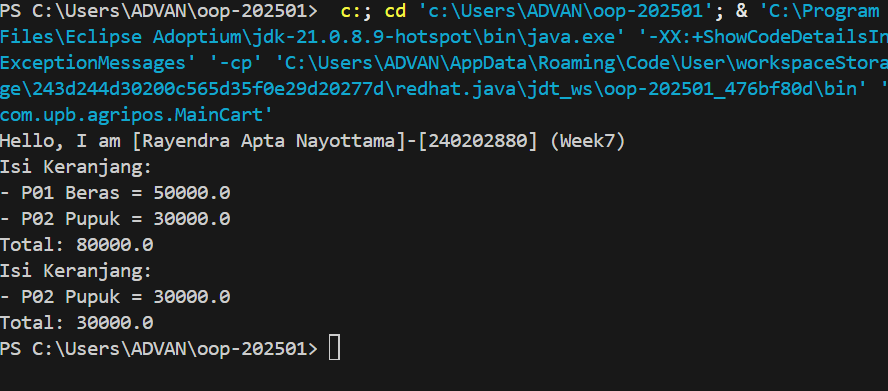

# Laporan Praktikum Minggu 7 
Topik: koleksi keranjang

## Identitas
- Nama  : [Rayendra Apta Nayottama]
- NIM   : [240202880]
- Kelas : [3 IKRA]

---

## Tujuan
(Tuliskan tujuan praktikum minggu ini.  
Memahami konsep Java Collections (List, Map, Set).
Menggunakan ArrayList untuk menyimpan dan mengelola objek Product.
Mengimplementasikan Map untuk pengelolaan quantity produk.
Melakukan operasi tambah, hapus, dan hitung total transaksi.

Menganalisis efisiensi penggunaan collection pada sistem Agri-POS.

---

## Dasar Teori
(Tuliskan ringkasan teori singkat (3–5 poin) yang mendasari praktikum.  
Contoh:  
Java Collections Framework menyediakan struktur data siap pakai untuk menyimpan dan memanipulasi kumpulan objek secara dinamis.
List (ArrayList): Menyimpan data secara terurut dan memperbolehkan duplikasi.
Map (HashMap): Menyimpan data dalam bentuk pasangan key–value.
Set (HashSet): Menyimpan data unik tanpa duplikasi.
Collections sangat penting dalam pengembangan aplikasi POS karena data transaksi bersifat dinamis.

---

## Langkah Praktikum
(Tuliskan Langkah-langkah dalam prakrikum, contoh:
1. Langkah-langkah yang dilakukan (setup, coding, run).  
2. File/kode yang dibuat.  
3. Commit message yang digunakan.)

---

## Kode Program
(Tuliskan kode utama yang dibuat, contoh:  

```java
// Contoh
package com.upb.agripos;

public class MainCart {
    public static void main(String[] args) {
        System.out.println("Hello, I am [Rayendra Apta Nayottama]-[240202880] (Week7)");

        Product p1 = new Product("P01", "Beras", 50000);
        Product p2 = new Product("P02", "Pupuk", 30000);

        ShoppingCart cart = new ShoppingCart();
        cart.addProduct(p1);
        cart.addProduct(p2);
        cart.printCart();

        cart.removeProduct(p1);
        cart.printCart();
    }
}

package com.upb.agripos;

public class Product {
    private final String code;
    private final String name;
    private final double price;

    public Product(String code, String name, double price) {
        this.code = code;
        this.name = name;
        this.price = price;
    }

    public String getCode() { return code; }
    public String getName() { return name; }
    public double getPrice() { return price; }
}

package com.upb.agripos;

import java.util.ArrayList;

public class ShoppingCart {
    private final ArrayList<Product> items = new ArrayList<>();

    public void addProduct(Product p) { items.add(p); }
    public void removeProduct(Product p) { items.remove(p); }

    public double getTotal() {
        double sum = 0;
        for (Product p : items) {
            sum += p.getPrice();
        }
        return sum;
    }

    public void printCart() {
        System.out.println("Isi Keranjang:");
        for (Product p : items) {
            System.out.println("- " + p.getCode() + " " + p.getName() + " = " + p.getPrice());
        }
        System.out.println("Total: " + getTotal());
    }
}
```
)
---

## Hasil Eksekusi
(Sertakan screenshot hasil eksekusi program.  

)
---

## Analisis
(
- Jelaskan bagaimana kode berjalan.  
- Apa perbedaan pendekatan minggu ini dibanding minggu sebelumnya.  
- Kendala yang dihadapi dan cara mengatasinya.
---

## Kesimpulan  
Dengan menggunakan Java Collections Framework, khususnya ArrayList, program keranjang belanja menjadi lebih terstruktur, fleksibel, dan mudah dikembangkan. Konsep ini sangat cocok diterapkan pada sistem POS seperti Agri-POS.

---

## Quiz
(1. Jelaskan perbedaan mendasar antara List, Map, dan Set.  
   List menyimpan data terurut dan boleh duplikat, Map menyimpan data dalam bentuk key–value, sedangkan Set menyimpan data unik tanpa duplikasi.

2. Mengapa ArrayList cocok digunakan untuk keranjang belanja sederhana? 
   Karena ArrayList mudah digunakan, fleksibel, dan mendukung penambahan serta penghapusan data secara dinamis. 

3. Bagaimana struktur Set mencegah duplikasi data?  
   Set menggunakan mekanisme hashing dan pengecekan kesamaan objek sehingga data yang sama tidak dapat disimpan lebih dari satu kali.
